# 購買申請システム 利用者マニュアル（ドラフト）

**版数**: v0.2
**対象**: 全従業員
**最終更新**: 2026-03-28

---

## はじめに

本マニュアルは、Slack上で動作する購買申請システムの使い方を説明します。
従来のメール・スプレッドシートベースの申請フローに代わり、Slackのコマンドとボタン操作で購買申請から仕訳計上までを完結できます。

### このマニュアルで使う用語

| 用語 | 意味 |
|------|------|
| **購買申請** | 物品やサービスを購入する前に、システムに登録して承認を得ること |
| **証憑（しょうひょう）** | 購入を証明する書類のこと。**納品書・領収書・請求書**などを指します。買い物をしたら必ずもらう「レシート」や「納品書」がこれにあたります |
| **検収（けんしゅう）** | 届いた物品が注文通りか確認すること。「届いたので受け取りました」の報告 |
| **仕訳（しわけ）** | 会計処理のこと。管理本部が行うので申請者は意識不要です |
| **PO番号 / PR番号** | 申請ごとに自動発行される管理番号（例: PR-0050） |
| **MFバーチャルカード** | MFビジネスカードで発行されるオンライン決済専用カード。社員ごとに1枚配布されます |
| **MFクラウド経費** | マネーフォワードの経費精算サービス。立替払いの精算時に使います |
| **MF会計Plus** | マネーフォワードのクラウド会計ソフト。仕訳・決算に使います（管理本部が操作） |
| **立替精算** | 個人のお金で先に買い、後から会社に払い戻してもらうこと。MFクラウド経費で申請が必要です |
| **カード明細照合** | カード利用明細と購買申請を突き合わせ、未申請の利用がないかチェックすること（管理本部の月次作業） |
| **OCR** | 画像から文字を読み取る技術。証憑添付時に金額を自動チェックします |
| **OPSチャネル** | 管理本部向けのSlackチャンネル（#purchase-ops）。システム通知が届きます |

### 対象読者

| 章 | 対象 |
|----|------|
| 第1章〜第4章 | 全従業員（申請者） |
| 第5章 | 部門長（承認者） |
| 第6章 | 管理本部 |
| 第7章 | 出張申請を行う方 |
| 付録 | 全員 |

### 全体フロー

購買申請から会計処理までの全体の流れです。自分が今どのステップにいるかを確認できます。

```
┌──────────────────────────────────────────────────────────────────────┐
│                      購買申請システム 全体フロー                       │
├──────────────────────────────────────────────────────────────────────┤
│                                                                      │
│  ① 申請        ② 承認        ③ 発注        ④ 検収        ⑤ 証憑   │
│  ───────      ───────      ───────      ───────      ───────        │
│  /purchase    部門長が      カードで      届いたら      納品書を      │
│  で入力       ボタン1つ     購入         ボタン1つ     スレッドに    │
│  (2-3分)      (10秒)       (申請者)      (10秒)       添付(30秒)    │
│                                                                      │
│      ↓            ↓            ↓            ↓            ↓          │
│                                                                      │
│  ⑥ 仕訳        ⑦ 照合        ⑧ 引落                               │
│  ───────      ───────      ───────                                  │
│  MF会計Plus   カード明細    銀行引落      ← ⑥⑦⑧は管理本部の作業   │
│  に自動登録    と突合(月次)  と突合(月次)    申請者は意識不要         │
│                                                                      │
└──────────────────────────────────────────────────────────────────────┘
```

**申請者がやること**: ①→③→④→⑤（4ステップ）
**部門長がやること**: ②のみ（承認ボタンを押すだけ）
**管理本部がやること**: ⑥⑦⑧（経理処理）

> 請求書払いの場合、発注後に届いた請求書をSlackスレッドまたはマイページから提出してください。

---

## 第1章: 購買申請の出し方

### 1.1 Slackモーダルで申請する

1. Slackのどのチャンネル・DMからでも `/purchase` と入力して送信（投稿先は #purchase-request に固定されるため、打った場所には何も残りません）
2. 入力方法の選択画面が表示されます
   - **Slackモーダルで入力** — 簡単な申請向き
   - **Webフォームで入力** — ファイル添付や入力補助が使えます
3. 「Slackモーダルで入力」を選ぶとフォームが開きます

### 1.2 入力項目

| 項目 | 必須 | 説明 | 入力例 |
|------|------|------|--------|
| 申請区分 | ★ | 「購入前」または「購入済」を選択 | 購入前 |
| 品目名 | ★ | 何を買うか | 会議用モニター |
| 単価（税抜） | ★ | 1個あたりの価格 | 45000 |
| 数量 | ★ | 購入数 | 1 |
| 支払方法 | ★ | 「会社カード」または「請求書払い」 | 会社カード |
| 購入先 | ★ | 購入先の名前 | Amazon |
| 購入目的 | ★ | 業務利用/プロジェクト利用 | 業務利用 |
| 受取場所 | ★ | 本社/支社/リモート | 本社 |
| 商品URL | | ECサイトのURL（自動で情報取得） | https://amazon.co.jp/... |
| 備考 | | 補足事項 | 至急希望 |

### 1.3 申請後の流れ

申請すると以下が自動で行われます:

1. **#purchase-request チャンネル** に申請内容が投稿されます
2. **部門長にDM** で承認依頼が届きます
3. 申請者には「申請を受け付けました」のDMが届きます

> 申請番号（例: `PR-0050`）が発行されます。この番号で申請を追跡できます。

### 1.4 Webフォームで申請する

`/purchase` → 「Webフォームで入力」を選ぶとブラウザが開きます。

Webフォームは **ステップ形式（4段階）** で案内に沿って入力できます。

#### ステップ1: 申請区分の選択

- 「購入前」または「購入済（立替）」を選択
- 購入済を選ぶと証憑添付が必須になります

#### ステップ2: 商品情報の入力

- 品目名・単価・数量・購入先・支払方法を入力
- **商品URL自動解析**: URLを貼ると商品名・価格を自動取得（Amazon/モノタロウ/ASKUL/ヨドバシ/ビックカメラ対応）
- **購入先サジェスト**: 過去の購入先から候補を自動表示
- **金額カンマフォーマット**: 入力中は数字のみ、フォーカス外すと `45,000` のように自動整形
- **合計金額の自動計算**: 単価 x 数量がリアルタイムで表示されます

#### ステップ3: 詳細情報の入力

- **条件分岐**: 申請区分・支払方法に応じて入力項目が動的に変化
  - 購入済 → 証憑ファイルアップロードが表示
  - プロジェクト利用 → HubSpot案件ID入力欄が表示
- **KATANA POサジェスト**: 在庫管理システムKATANAのPO番号を検索・選択
- **承認ルートプレビュー**: 金額に応じた承認ルートがリアルタイム表示
  - 例: 「部門長（山田）→ 承認完了」
- **ファイルアップロード**: 見積書・参考資料をドラッグ&ドロップ、カメラ撮影にも対応
- **過去申請の複製**: 過去の申請一覧から選んでワンクリックで内容をコピー

#### ステップ4: 確認画面

送信前に入力内容を最終確認できます。この画面では:

- **重複チェック**: 同じ品目名・金額の過去申請がある場合に警告表示
  - 例: 「類似の申請が 2 件見つかりました — PR-0042: 会議用モニター ¥45,000（3/15 田中）」
- **勘定科目推定**: 品目名と金額から推定された勘定科目が表示
  - 例: 「推定勘定科目: 消耗品費 / 事務用品（確度: 高）」
- 内容に問題があれば「戻る」で修正可能
- 「送信する」で申請完了

#### 一括申請（複数品目）

同じ購入先で複数の品目を購入する場合:

1. ステップ2の画面下部にある「品目を追加」ボタンを押す
2. 追加品目ごとに品目名・単価・数量・URLを入力
3. 全品目の合計金額がリアルタイムで表示されます
4. 送信すると、メインの品目と追加品目がそれぞれ個別のPO番号で登録されます

#### 下書き保存

- 入力中の内容は **自動的に下書き保存** されます（0.5秒ごと）
- ブラウザを閉じて後から開き直すと、前回の入力内容が自動復元されます
- 送信完了時に下書きは自動削除されます
- ブラウザのローカルストレージに保存されるため、同じブラウザでのみ有効です

#### 商品URL自動解析の詳細

Webフォームのステップ2で「商品URL」欄にECサイトのURLを貼ると、商品情報を自動取得します。

**対応サイト:**

| サイト | 取得される情報 | 備考 |
|--------|-------------|------|
| Amazon.co.jp | 商品名・価格・画像 | サーバー側でブロックされる場合はURL文字列から商品名を推定 |
| モノタロウ | 商品名・価格 | 安定して取得可能 |
| ASKUL | 商品名・価格 | 安定して取得可能 |
| ヨドバシ.com | 商品名・価格 | |
| ビックカメラ | 商品名・価格 | |

**使い方:**

1. ECサイトで購入したい商品のページを開く
2. ブラウザのアドレスバーからURLをコピー
3. Webフォームの「商品URL」欄に貼り付け
4. 自動的に商品名と価格が入力欄に反映されます
5. 必要に応じて修正してください

**注意事項:**
- Amazon等のサイトはサーバー側からのアクセスをブロックすることがあります。その場合、URLの文字列から商品名のみ取得します（金額は手動入力が必要です）
- 上記以外のサイトのURLを貼った場合は「このドメインには対応していません」と表示されます
- 取得された金額は参考値です。必ず実際の価格を確認してください

---

#### ブックマークレットからの起動

ECサイトの商品ページを見ながら、**ワンクリックで購買申請フォームを開く**ことができます。

**初回設定（1回だけ）:**

1. ブラウザで `https://next-procurement-poc.vercel.app/bookmarklet` にアクセス
2. 緑色の「購買申請」ボタンを**ブックマークバーにドラッグ&ドロップ**
3. 初回利用時にSlack User IDの入力を求められます（1回入力すれば記憶されます）

**使い方:**

1. Amazon等で購入したい商品のページを開く
2. ブックマークバーの「購買申請」をクリック
3. 新しいタブで購買申請フォームが開きます
4. **商品名・価格・購入先・URLが自動入力済み**
5. 残りの項目（支払方法・数量等）を入力して送信

**対応サイト:**
- Amazon（商品名 + 価格を自動取得）
- モノタロウ（商品名 + 価格）
- ASKUL（商品名 + 価格）
- ヨドバシ.com（商品名）
- ビックカメラ（商品名）
- その他のサイト（ページタイトルを商品名として取得）

> ブックマークレットはブラウザ上で動作するため、サーバー側のブロックの影響を受けず、Amazon等でも安定して情報を取得できます。

---

## 第2章: 承認後の操作

### Slackメッセージの見え方

申請を送信すると、#purchase-request チャンネルに以下のようなメッセージが投稿されます。

**承認待ちの状態:**

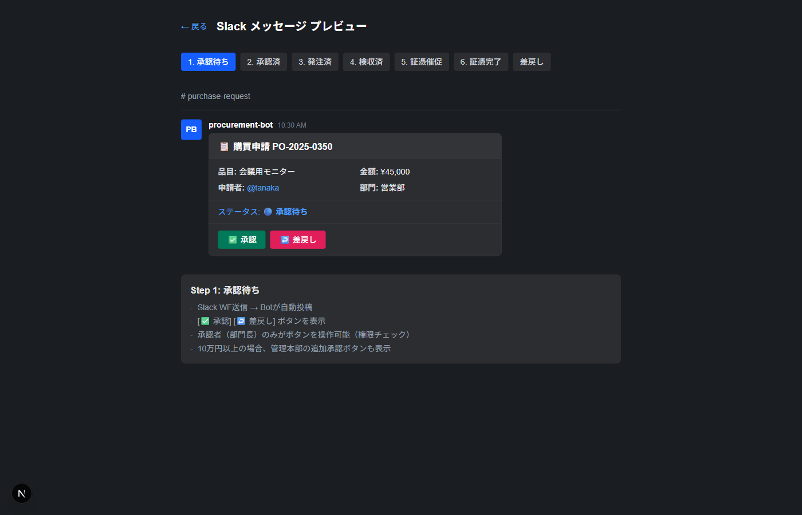

**承認後の状態:**

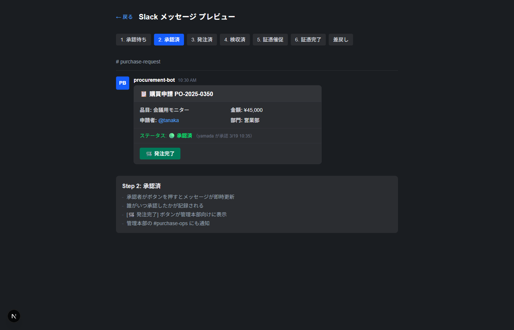

**発注完了後の状態:**

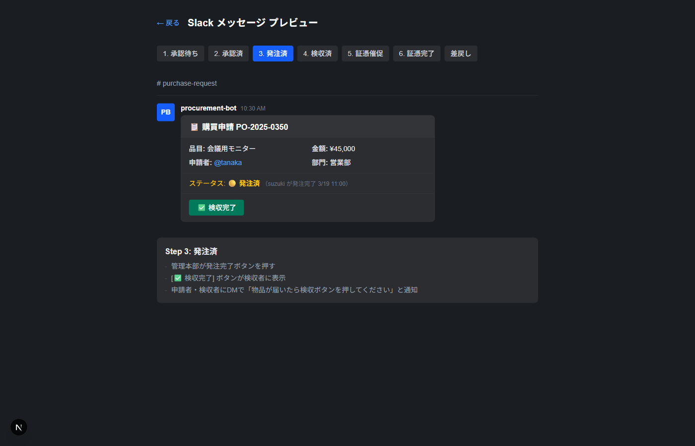

### 2.1 承認された場合

承認されると、支払方法に応じて次の操作が変わります:

**会社カードの場合:**

1. Bot DMで「承認されました。カードで発注してください」と届きます
2. MFビジネスカード（VISA）で商品を購入します
3. #purchase-request の申請メッセージにある **[発注完了]** ボタンを押します

**請求書払いの場合:**

1. Bot DMで「承認されました。発注してください」と届きます
2. 自分で購入先に発注します（電話・メール・Webサイト等）
3. **[発注完了]** ボタンを押します
4. 届いた請求書をSlackスレッドまたはマイページから提出します（証憑として処理されます）

> VISAが使えない購入先の場合は「請求書払い」を選択してください。

### 2.2 差戻しされた場合

部門長から差戻しされた場合:

1. Bot DMで「差戻しされました」と理由が届きます
2. 内容を修正して、再度 `/purchase` で新しい申請を出してください
3. 元の申請番号は無効になります（新しい番号が発行されます）

### 2.3 申請を取り消す場合

発注前であれば、#purchase-request の申請メッセージにある **[取消]** ボタンで取り消せます。

> 発注後の取消はできません。管理本部に連絡してください。

---

## 第3章: 検収と証憑の提出

> **証憑（しょうひょう）** = 購入を証明する書類のこと。納品書・領収書・請求書など、いわゆる「レシート」です。
> これをシステムに提出しないと経理処理が進みません。

### MFカードで買った場合、証憑はどうなるの？

MFビジネスカードで購入すると、カード利用明細がMFクラウド経費に**自動的に取り込まれます**。
しかし、カード明細だけでは「何を買ったか」の証明にはなりません。

**2つの仕組みの関係:**

```
MFカード決済
  ├── MFクラウド経費（自動）  ← カード明細が自動連携される
  │     → 「いつ・いくら・どこで使ったか」がわかる
  │     → ただし品目の詳細や税率の情報はない
  │
  └── 購買申請システム（手動）  ← 証憑を添付する場所はここ
        → 「何を買ったか・税額はいくらか」がわかる
        → 適格請求書の番号もここで記録される
```

**申請者がやること（2ステップ）:**

| ステップ | やること | 場所 |
|---------|---------|------|
| 1 | **証憑を添付** | 購買申請システム（Slack or マイページ） |
| 2 | **経費申請を提出** | MFクラウド経費 |

**証憑の添付（ステップ1）だけで、以下は自動で処理されます:**

```
申請者: Slackスレッド（or マイページ）に証憑を添付
  ↓ 自動
購買申請システム:
  ├── OCR金額照合（Gemini Vision）
  ├── GASステータス更新（「添付済」）
  └── MFクラウド経費に証憑を自動転送
       → MF経費側に経費明細（下書き）が自動作成される
```

**ただし、MF経費での経費申請の提出は自分で行う必要があります:**

```
申請者: MFクラウド経費を開く
  → 自動転送された経費明細（下書き）を確認
  → 経費申請として提出
```

| 仕組み | 役割 | 申請者の操作 |
|--------|------|------------|
| **購買申請システム** | 申請→承認→証憑管理 + OCR照合 | **証憑を添付** |
| **MFクラウド経費** | カード明細管理 + 経費精算 | **経費申請を提出**（証憑は自動転送済み） |
| **週次突合バッチ** | 上記2つを自動照合 | なし（自動） |

> まとめ: 証憑の添付は購買申請システムの1箇所でOK（MF経費に自動転送されます）。ただし**MF経費での経費申請の提出は別途必要**です。

### 3.1 検収する

物品が届いたら:

1. #purchase-request の該当する申請メッセージを探します
2. **[検収完了]** ボタンを押します
3. 「検収記録しました」とスレッドに表示されます

### 3.2 証憑を提出する

**証憑未提出の場合、催促が届きます:**

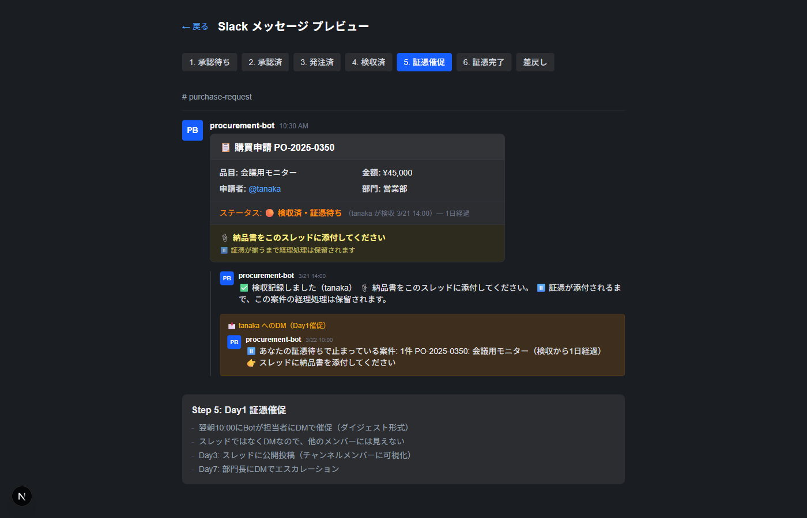

**証憑提出が完了すると:**

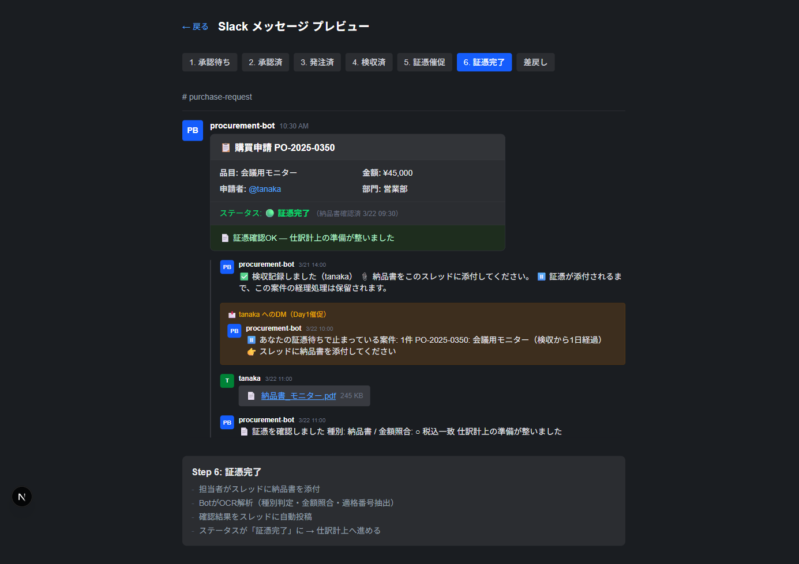

検収後、**納品書・領収書** をシステムに提出する必要があります。

**2つの提出方法があります。どちらでも同じ処理が実行されます。**

**方法A: Slackスレッドに添付（推奨）**

1. 証憑ファイル（PDF or 写真）を用意します
2. #purchase-request の該当申請の **スレッド** を開きます
3. スレッドにファイルを **ドラッグ&ドロップ** します

**方法B: マイページからアップロード**

1. `https://{システムURL}/purchase/my` を開きます
2. 該当する申請をクリックします
3. 右パネルのドロップエリアにファイルを投入します

> スマホからの場合はマイページが便利です（カメラで撮影→そのままアップロード）。

**対応ファイル形式:** PDF、JPEG、PNG、HEIC、WebP、TIFF

**支払方法別の提出書類:**

| 支払方法 | 提出する書類 | 備考 |
|---------|------------|------|
| **カード払い** | 納品書 or 領収書 | カード明細は自動連携されるので不要 |
| **請求書払い** | **請求書** | 届いた請求書が証憑になります。管理本部が支払処理 |
| **立替（購入済）** | レシート or 領収書 | MF経費経由で給与精算されます |

**添付後の自動処理:**

1. Botが証憑を自動検知します
2. 種別を判定します（納品書/領収書/請求書）
3. OCRで金額を読み取り、申請金額と照合します
4. 結果がスレッドに表示されます:
   - `金額照合: 金額一致` → 正常
   - `金額照合: 金額不一致` → 管理本部が確認します

### 3.3 どの書類を提出すればいいか

購入先によって入手できる書類が異なります。以下を参考にしてください。

#### 購入先別の証憑入手方法

| 購入先 | 提出する書類 | 入手方法 |
|--------|------------|---------|
| **Amazon** | 購入明細書 or 領収書 | 注文履歴 → 「領収書等」→ PDF保存 |
| **モノタロウ** | 納品書（同梱）or Web領収書 | 商品に同梱 / マイページからPDFダウンロード |
| **ASKUL** | 納品書（同梱） | 商品に同梱されている納品書を撮影 |
| **ヨドバシ/ビックカメラ** | 領収書 | マイページ → 注文履歴 → 領収書発行 |
| **実店舗** | レシート or 領収書 | 購入時にもらったレシートを撮影 |
| **SaaS/サブスクリプション** | 請求書 or 利用明細 | メールで届く請求書PDF / 管理画面からダウンロード |
| **請求書払いのベンダー** | 請求書 | ベンダーから届いた請求書をスキャン or PDF保存 |

> **Amazon で購入した場合の領収書の出し方:**
> 1. Amazon にログイン → 「注文履歴」
> 2. 該当注文の「領収書等」ボタンをクリック
> 3. 「領収書/購入明細書」を選択
> 4. 表示された画面をPDFとして保存（ブラウザの「印刷」→「PDFに保存」）
> 5. そのPDFをSlackスレッドに添付

#### 証憑がない場合

以下のケースでは証憑が手元にない場合があります:

| ケース | 対応方法 |
|--------|---------|
| レシートを紛失した | 管理本部に相談。**カード利用明細のスクリーンショット**で代替できる場合があります |
| 納品書が同梱されていなかった | 購入先のWebサイトから領収書をダウンロード |
| メールの請求書しかない | メールのPDFまたはスクリーンショットを添付 |
| 海外サービスで日本語書類がない | 英語の Invoice/Receipt でOK |
| どうしても入手できない | 管理本部に相談してください。状況に応じて対応します |

> 「証憑がないから申請できない」ということはありません。まず申請を出して、証憑は後から添付できます。ただし、証憑がないと経理処理は進みません。

#### 適格請求書（インボイス）について

2023年10月から始まったインボイス制度により、消費税の仕入税額控除を受けるには**適格請求書**が必要です。

**申請者が意識すること:**

- **特別な操作は不要です** — システムが証憑添付時にOCRで自動判定します
- 適格請求書の場合: `T`から始まる13桁の登録番号が書類に記載されています
- システムが検出すると「適格請求書: T1234567890123」と自動表示されます

**知っておくとよいこと:**

| 項目 | 内容 |
|------|------|
| 適格請求書とは | 登録番号（T+13桁）が記載された請求書・領収書 |
| なぜ必要か | 消費税の控除に必要（会社の税負担に影響） |
| Amazon の場合 | Amazonが直接販売した商品は適格請求書あり。**マーケットプレイス出品者は登録がない場合があります** |
| 実店舗の場合 | ほとんどの店舗はレジのレシートが適格簡易請求書に対応済み |
| 対応していない場合 | 購入自体は問題ありません。管理本部が税務処理を調整します |

> Amazonマーケットプレイスで購入する場合、出品者が適格請求書発行事業者でないケースがあります。可能であれば「Amazon.co.jp が発送」の商品を選ぶと税務上有利です。ただし、これは推奨であり必須ではありません。

### 3.4 証憑を提出しないとどうなるか

証憑がないと会計処理（仕訳登録・支払）に進めません。
システムが自動でリマインドします:

| 経過日数 | リマインド方法 |
|---------|-------------|
| 翌日 | DMで「証憑を提出してください」（未提出分をまとめて1通） |
| 3日後 | スレッドに公開で投稿（@メンション付き — 周りにも見えます） |
| 7日後 | 部門長にエスカレーション（「○○さんの証憑が7日未提出です」） |

> 証憑の提出が遅れると、次回の申請時に部門長の承認画面に「未提出一覧」が表示されます。

### 3.5 マイページで申請状況を確認する

`https://{システムURL}/purchase/my` で自分の申請一覧を確認できます。

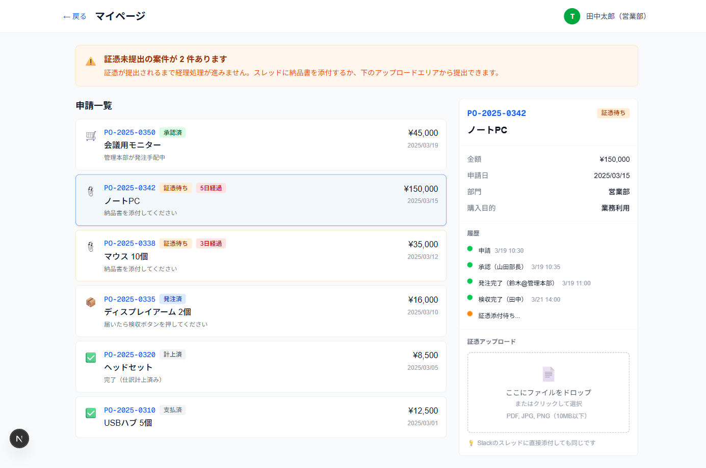

- 証憑未提出の案件は黄色いアラートで表示されます
- 案件をクリックすると詳細と履歴が表示されます
- 証憑アップロードもマイページから可能です（ファイルをドロップ）

---

## 第4章: 購入済申請（立替精算）

すでに購入済みの場合（緊急時のみ）:

### 4.1 手順

1. `/purchase` → 申請区分: **「購入済」** を選択
2. 通常通り品目・金額を入力
3. **証憑（レシート・領収書）を必ず添付してください**
4. 承認後、自動的に「検収済・証憑待ち」になります

### 4.2 注意事項

- 購入済申請は **緊急時の例外措置** です
- 原則として、事前に `/purchase` で申請し、MFバーチャルカードで購入してください
- 証憑なしの購入済申請は処理されません

---

## 第5章: 承認者（部門長）向け

### 5.1 承認依頼の受け取り

部下が購買申請を出すと、BotからDMで承認依頼が届きます:

```
承認依頼: PR-0050 会議用モニター ¥45,000（田中）
[承認]  [差戻し]
```

### 5.2 承認する

**[承認]** ボタンを押すだけです。

- DMからでも #purchase-request からでも承認できます
- 承認すると申請者にDMで通知され、申請者が発注します

### 5.3 差戻しする

**[差戻し]** ボタンを押すと、理由入力のモーダルが開きます。
理由を入力して送信すると、申請者にDMで通知されます。

**差戻し後の表示:**

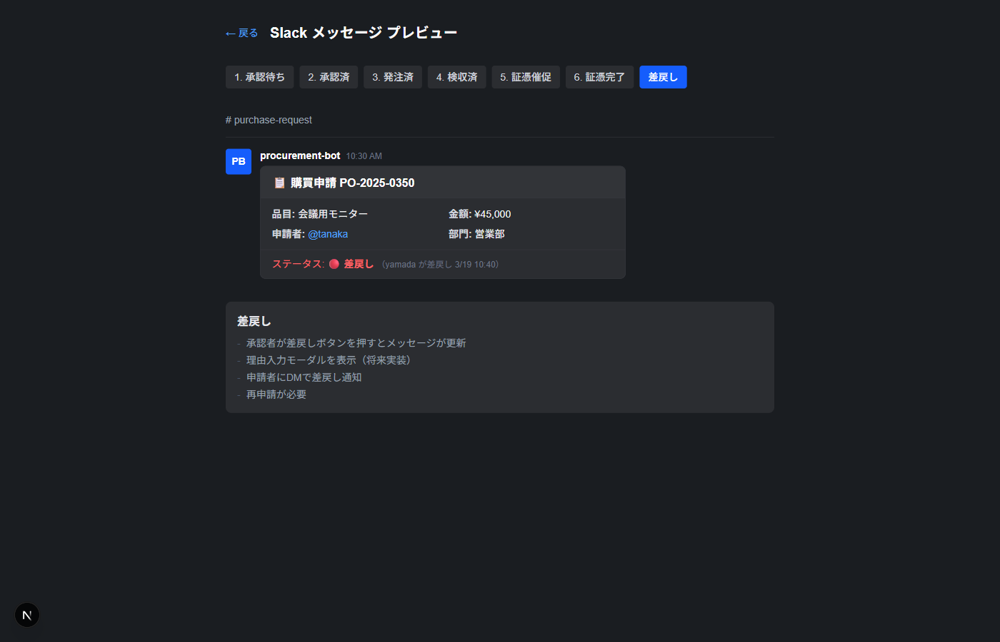

### 5.4 承認時の確認ポイント

承認依頼には以下の情報が表示されます:

- 品目名・金額・購入先・支払方法
- 申請者の **証憑未提出一覧**（過去の未提出があれば表示）
- 推定勘定科目

> 未提出証憑が多い申請者の場合、先に証憑提出を促してから承認することを推奨します。

---

## 第6章: 管理本部向け

**管理ダッシュボード** (`/dashboard`):

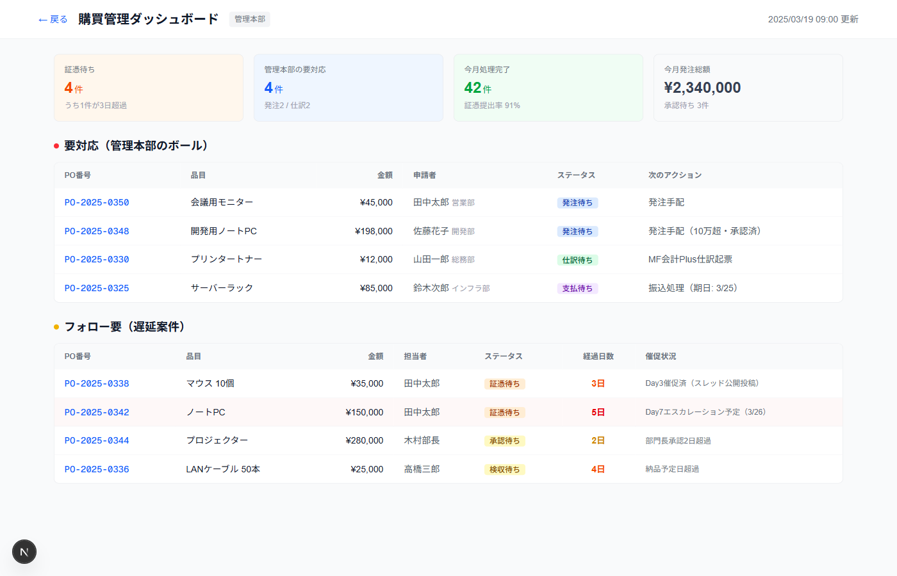

### 6.1 朝のルーティン

毎朝 09:00 に **#purchase-ops** チャンネルに日次サマリが自動投稿されます:

```
📊 購買日次サマリ — 2026/3/27

🔴 要対応（5件）
  承認待ち: 2件
  発注待ち: 3件
  • PR-0050: サーバー機器（営業部 田中, 2日経過）[開く]
  • PR-0048: ソフトウェアライセンス（開発部 佐藤, 1日経過）[開く]

🟡 フォロー要（2件） — 3日以上停滞
  ⚠️ PR-0042: 会議用モニター（田中, 5日経過）[開く]
  🚨 PR-0039: プリンター（鈴木, 8日経過）[開く]

🟢 順調 — 進行中: 8件 / 完了: 45件
```

### 6.2 証憑・請求書の受付

発注は全件申請者が行います。管理本部は提出された証憑・請求書を受けて経理処理を行います。

**証憑が提出されると:**
1. Botが自動検知し、種別判定（納品書/領収書/請求書）+ OCR金額照合を実行
2. ステータスが「証憑完了」に更新され、#purchase-ops に通知
3. 管理本部は仕訳登録に進みます

**請求書払いの場合:**
- 申請者が発注後、届いた請求書をSlackスレッドまたはマイページから提出
- 管理本部は請求書を確認し、支払処理（銀行振込等）を行います

### 6.3 仕訳登録

証憑完了の案件を MF会計Plus に仕訳登録します:

1. #purchase-ops の日次サマリで「証憑完了」案件を確認
2. **[仕訳登録]** ボタンを押す（またはAPI経由）
3. 自動的に仕訳ドラフトが作成されます:
   - 借方: 費用科目（消耗品費等 — 自動推定）
   - 貸方: 未払金（カード）or 買掛金（請求書）
   - 摘要: PO番号 + 購入先名
4. GASのステータスが「計上済」に更新されます

### 6.4 カード明細突合レポート（週次自動）

毎週月曜 11:00 に自動実行され、#purchase-ops にレポートが投稿されます:

```
🔍 カード明細突合レポート — 2026/3/27
対象: 15件の明細 / 42件の申請

✅ マッチ: 12件
🔴 未申請: 2件
🟡 承認前購入: 1件

🚨 要対応:
  • 未申請購入検知: Amazon.co.jp ¥12,800 (2026-03-22)
  • 未申請購入検知: ヨドバシカメラ ¥5,400 (2026-03-24)
```

未申請購入は該当者に確認し、追加で購買申請を出してもらいます。

### 6.5 カード明細照合UI（月次手動）

月初に、前月分のカード利用明細を照合UIで一括チェックします。

**アクセス**: `https://{システムURL}/admin/card-matching`

**初期画面（CSV読込前）:**

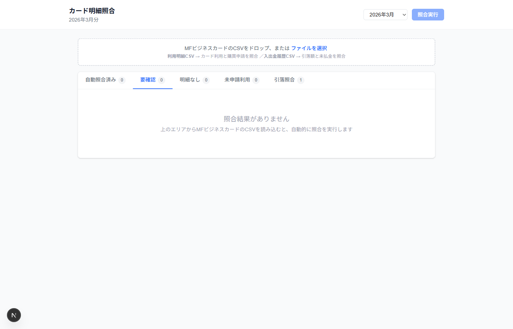

#### Step 1: CSVの準備

MFビジネスカード管理画面から前月分の**利用明細CSV**をダウンロードします。

#### Step 2: CSV読込と照合実行

1. 照合UIを開き、月を選択（前月）
2. CSVファイルをドロップエリアにドラッグ、またはファイル選択
3. 自動的に照合が開始されます（5-10秒）

#### Step 3: 4つのタブを処理

**「自動照合済み」タブ** — 差額ありは黄色で強調表示されます:

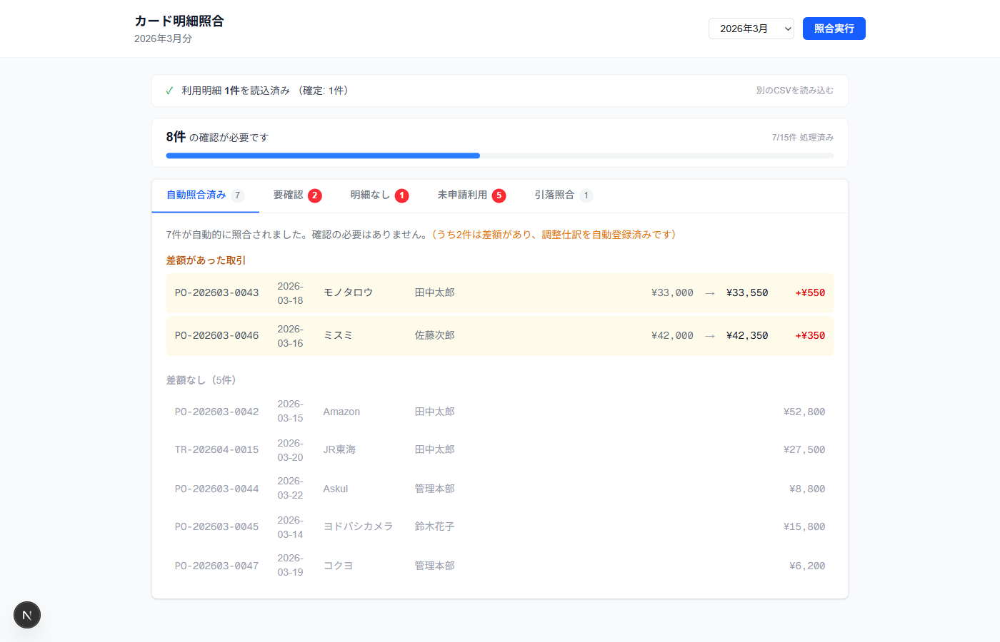

**「要確認」タブ** — 差異タグ（日付/金額/取引先名）を見て正しい明細を選択:

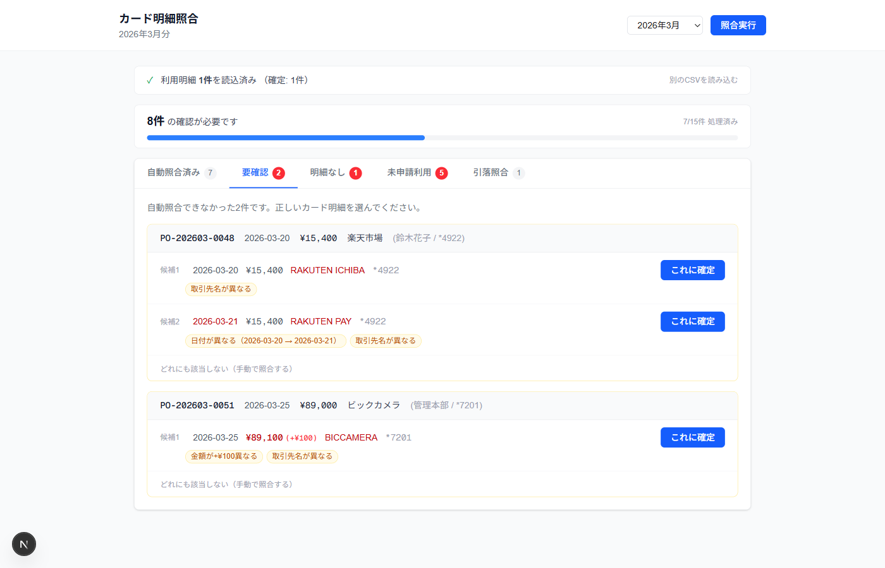

**「明細なし」タブ** — 月末利用で翌月確定の可能性:

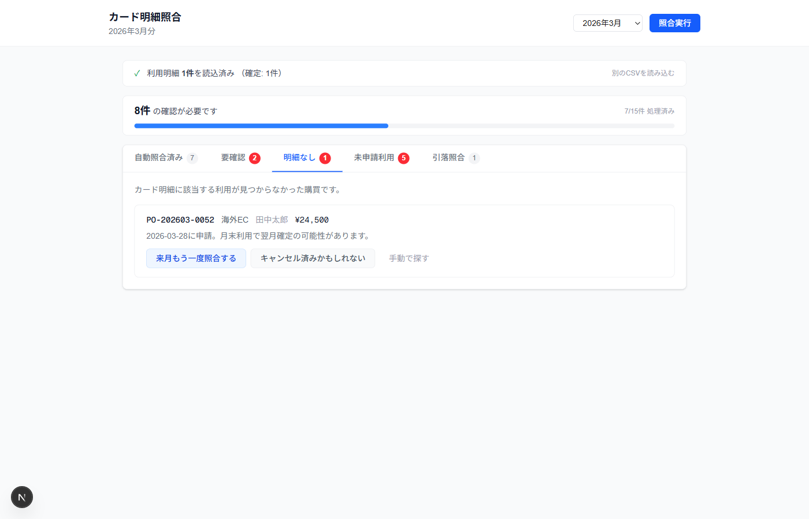

**「未申請利用」タブ** — 本人に確認するか経費処理:

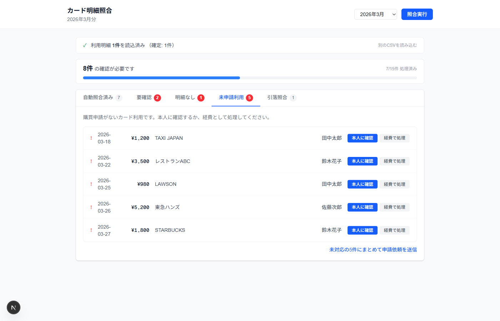

| タブ | 見るもの | やること |
|------|---------|---------|
| **自動照合済み** | 申請と明細が自動マッチした件 | 確認のみ。差額ありは調整仕訳済み |
| **要確認** | 候補が複数ある件 | 差異タグを見て正しい明細を選択 → [これに確定] |
| **明細なし** | 申請はあるがカード明細にない件 | [来月もう一度照合] or [キャンセル済み] |
| **未申請利用** | カード明細はあるが申請がない件 | [本人に確認] or [経費で処理] |

> プログレスバーが表示されます。全件処理すると完了バナーが表示されます。

#### Step 4: 引落照合

**「引落照合」タブ:**

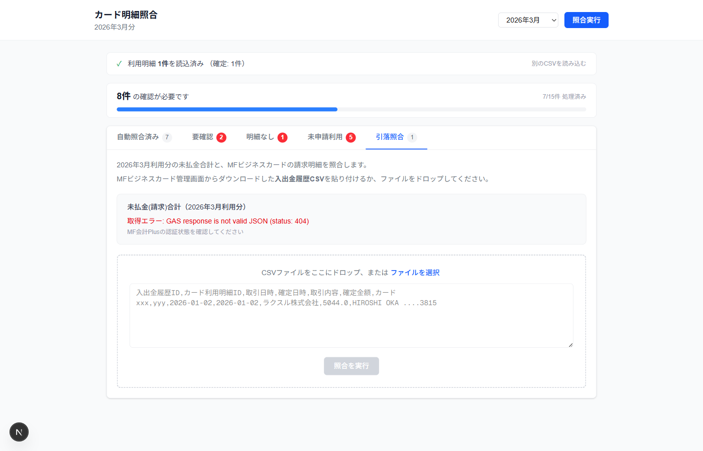

1. 「引落照合」タブを開く → MF会計Plusから未払金(請求)合計が自動表示されます
2. MFビジネスカード管理画面から**入出金履歴CSV**をダウンロード
3. CSVをドロップまたは貼り付け → [照合を実行]
4. 未払金合計と引落額を比較:
   - 一致 → [消込を確定する]
   - 差額あり → 原因ガイドを参照して調査

**よくある差額原因:**

| 原因 | 対応 |
|------|------|
| 月末利用分が翌月確定に繰越 | 翌月の引落に含まれる予定。来月再照合 |
| 返品・キャンセルで引落額が減額 | カード明細で返品分を確認 |
| 年会費など計上外の引落 | 引落明細の摘要を確認 |

#### 予測テーブルについて

購買申請がカード払いで承認されると、自動的に「予測テーブル」にレコードが生成されます:
- **カード下4桁** + **金額** + **予想利用日** が記録される
- 月次照合時にこの予測と実際のカード明細を自動マッチング
- マッチ率90%以上を目標（金額完全一致なら自動確定）

> 予測精度は従業員マスタのカード情報（G列: card_last4）が正しく設定されていることが前提です。

### 6.6 月次作業

| 作業 | 内容 | 所要時間目安 |
|------|------|------------|
| カード明細照合 | 照合UI（§6.5）で利用明細CSV → 4タブ全件処理 | 30-60分 |
| 引落照合 | 照合UI「引落照合」タブで入出金履歴CSV → 未払金突合 | 15分 |
| じゃらんCSV取込 | じゃらん管理画面からCSVダウンロード → システムにアップロード | 15分 |
| 仕訳一括処理 | 残っている「仕訳待ち」案件をまとめて処理 | 30分 |
| コンプライアンスレビュー | 未申請購入・承認前購入の件数と傾向を確認 | 15分 |
| 従業員別利用傾向確認 | 利用傾向ダッシュボード（§6.7）で異常傾向を確認 | 10分 |

### 6.7 従業員別利用傾向ダッシュボード

**アクセス**: `https://{システムURL}/admin/spending`

従業員ごとの購買金額・件数・傾向を一覧で確認できるダッシュボードです。

**画面構成:**
- **サマリカード**: 合計金額・申請件数・従業員数・従業員平均
- **部門別構成**: 部門ごとの利用額をスタックバーで可視化
- **従業員ランキング**: 金額順/件数順で切替可能。月別ミニバー表示
- **従業員詳細**: 選択すると月別推移・勘定科目別・支払方法別の内訳を表示

**使い方:**
1. 右上のプルダウンで期間を選択（1/3/6/12ヶ月）
2. 従業員ランキングで利用額が多い従業員を確認
3. 従業員名をクリックして詳細を確認
4. 月別推移で急増がないか、勘定科目に偏りがないかをチェック

**活用ポイント:**
- 月次コンプライアンスレビュー時に確認
- 特定の従業員の利用額が急増した場合は部門長に確認
- カード明細照合（§6.5）と合わせて使うと効果的

### 6.8 日次金額乖離アラート

毎日12:00にOPSチャネルへ自動投稿されます。管理本部が内容を確認してください。

**通知される内容:**
- 🔴 **金額乖離**: 購買申請の予測額とカード実利用額の差が ±10% or ±¥1,000 を超える案件
- 🟡 **未マッチ停滞**: 予測明細が3日以上マッチされていない案件

**対応方法:**
- 金額乖離 → 申請者に差額の理由を確認（値引き、追加注文、為替変動など）
- 未マッチ停滞 → カード明細照合UIで手動確認、または申請者にカード決済の有無を確認

---

## 第7章: 出張申請（/trip）

### 7.1 出張申請の出し方

1. Slackで `/trip` と入力して送信
2. モーダルフォームが開きます

| 項目 | 必須 | 入力例 |
|------|------|--------|
| 行き先 | ★ | 大阪本社 |
| 出張開始日 | ★ | 2026-04-01 |
| 出張終了日 | ★ | 2026-04-03 |
| 出張目的 | ★ | クライアント打合せ |
| 利用交通手段 | ★ | 新幹線のぞみ 東京→新大阪 |
| 概算額（円） | ★ | 45000 |
| 宿泊先 | | じゃらんで予約済み |

3. 送信すると #出張チャンネル に投稿されます
4. DMで確認通知が届きます

### 7.2 宿泊の予約

**じゃらんJCS（法人向けサービス）を使用してください。**

1. じゃらんにログインして宿泊を予約
2. 予約時に「法人専用項目1」にプロジェクト番号を入力
3. 支払は会社宛ての請求書払い（個人負担なし）

> 楽天トラベルRacco も今後利用可能になります（現在準備中）。

### 7.3 航空券・新幹線・レンタカー

- **航空券**: ANA Biz または JAL Online で法人予約
- **新幹線**: スマートEX等で予約 → MFビジネスカードで決済
- **レンタカー**: MFビジネスカードで決済（利用交通手段欄に「レンタカー」と記入）
- **タイムズカーシェア**: MFビジネスカード登録 → 利用交通手段欄に「タイムズカー」と記入
- その他交通費（タクシー等）もMFカードで決済してください

### 7.4 出張後の精算

出張後の精算は基本的に自動です:
- カード決済分 → MF経費に自動連携 → 管理本部が仕訳
- 宿泊費 → じゃらんCSV一括取込（管理本部が月次処理）

立替が発生した場合は `/purchase` → 「購入済」で申請してください。

---

## 付録A: よくある質問（FAQ）

### Q1: 申請を間違えました。修正できますか？

**発注前なら [取消] で取り消し、再申請してください。**
発注後の修正はできません。管理本部に連絡してください。

### Q2: 証憑（納品書・領収書）を紛失しました。

管理本部に相談してください。カード明細のスクリーンショットなど、代替証憑で対応できる場合があります。

### Q3: 承認がなかなか来ません。

部門長にSlackで直接確認してください。システムからの催促は自動では行われません（証憑催促とは異なります）。

### Q4: 金額に関係なく自分で発注していいのですか？

はい。部門長の承認後は、金額に関係なく申請者自身が発注します。
高額品（10万円以上）は固定資産になる可能性があるため、購入品の用途・理由の入力が求められます。

### Q5: 請求書払いで購入した場合、証憑は何を出せばいいですか？

ベンダーから届いた **請求書** をSlackスレッドまたはマイページから提出してください。
請求書が証憑として処理され、管理本部が支払手続きを行います。
できれば**適格請求書（T+13桁の登録番号あり）** のものが税務上有利です。

### Q5.5: Amazonで買ったけど領収書はどうすれば？

注文履歴 →「領収書等」→「領収書/購入明細書」→ ブラウザの印刷→PDF保存 → スレッドに添付。
詳しくは第3章「購入先別の証憑入手方法」を参照してください。

### Q5.6: 適格請求書って何ですか？意識する必要ありますか？

**特に意識不要です。** システムが証憑添付時に自動判定します。
ただし、Amazonマーケットプレイス出品者は適格請求書を発行できない場合があります。
可能なら「Amazon.co.jp が発送」の商品を選ぶと税務上有利ですが、必須ではありません。

### Q6: Webフォームの下書きはいつまで保存されますか？

ブラウザのローカルストレージに保存されるため、同じブラウザであれば維持されます。
ブラウザのデータを消去すると下書きも消えます。

### Q7: 複数品目をまとめて申請できますか？

Webフォームでは「品目を追加」ボタンで複数品目を一括申請できます。
Slackモーダルでは1品目ずつの申請になります。

### Q8: 出張の承認フローはどうなっていますか？

現在、`/trip` コマンドは#出張チャンネルへの投稿のみで、システム上の承認フローはありません。
予約前にチャンネル投稿を通じて上長の了承を得る運用です。

### Q9: カード明細照合って何ですか？一般社員も使いますか？

**一般社員は使いません。** 管理本部が月次で実施する経理業務です。
MFビジネスカードの利用明細と購買申請を突き合わせて、未申請の利用がないかチェックします。
未申請利用が検知された場合のみ、管理本部から確認の連絡が届きます。

### Q10: 「カード払い」で承認されたのに予測テーブルに載っていません。

従業員マスタにカード下4桁（G列）が未登録の可能性があります。管理本部に確認してください。

### Q11: 照合UIで「照合エラー」が表示されます。

以下を確認してください:
- MFビジネスカードの正しいCSVフォーマットですか？（利用明細CSVまたは入出金履歴CSV）
- ネットワーク接続は正常ですか？
- GAS Web Appが正常に動作していますか？（`/api/test/gas` で確認可能）

---

## 付録B: トラブルシューティング

### 「購買申請の投稿先チャンネルが設定されていません」と表示される

管理本部に連絡してください。Slack App の環境変数設定が必要です。

### ボタンを押したが「操作権限がありません」と表示された

そのボタン操作はあなたの権限では実行できません:
- [承認] → 部門長のみ
- [発注完了] → 申請者・承認者・管理本部メンバー
- [検収完了] → 申請者のみ
- [取消] → 申請者のみ（発注前）

### 証憑を添付したがBotが反応しない

以下を確認してください:
1. **スレッド** に添付していますか？（メインメッセージではなくスレッド返信として）
2. 対応形式ですか？（PDF、JPEG、PNG等）
3. 購買申請のスレッドですか？（PO番号が含まれるメッセージのスレッド）

### 「金額不一致」と表示された

OCRが読み取った証憑の金額と、申請時の金額が一致しません。
管理本部が確認しますので、特に操作は不要です。
差額が大きい場合は管理本部から連絡があります。

---

## 付録C: 操作早見表

| やりたいこと | 操作 | 対象者 |
|-------------|------|--------|
| 購買申請を出す | `/purchase` → モーダルまたはWebフォーム | 全員 |
| 出張申請を出す | `/trip` → モーダル | 全員 |
| 申請を承認する | DM or #purchase-request の [承認] ボタン | 部門長 |
| 発注完了を報告する | #purchase-request の [発注完了] ボタン | 申請者/管理本部 |
| 検収完了を報告する | #purchase-request の [検収完了] ボタン | 申請者 |
| 証憑を提出する | 申請スレッドにファイルをドラッグ&ドロップ | 申請者 |
| 申請を取り消す | #purchase-request の [取消] ボタン（発注前のみ） | 申請者 |
| 自分の申請状況を確認する | `/purchase/my` | 全員 |
| カード明細を照合する | `/admin/card-matching` → CSV読込 | 管理本部 |
| 引落額を照合する | `/admin/card-matching` → 引落照合タブ | 管理本部 |
| 従業員別利用傾向を確認する | `/admin/spending` | 管理本部 |

---

## 改訂履歴

| 日付 | 版数 | 変更内容 |
|------|------|---------|
| 2026-03-28 | v0.3 | §6.7 従業員別利用傾向ダッシュボード追加、§6.8 日次金額乖離アラート追加、操作早見表更新 |
| 2026-03-28 | v0.2 | §6.5 カード明細照合UI操作手順追加、§6.6 月次作業更新、FAQ Q9-Q11追加、操作早見表に照合操作追加 |
| 2026-03-26 | v0.1 | ドラフト作成 |
